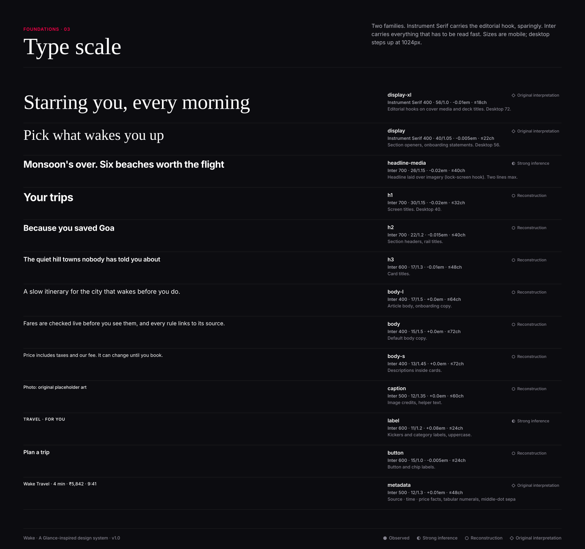
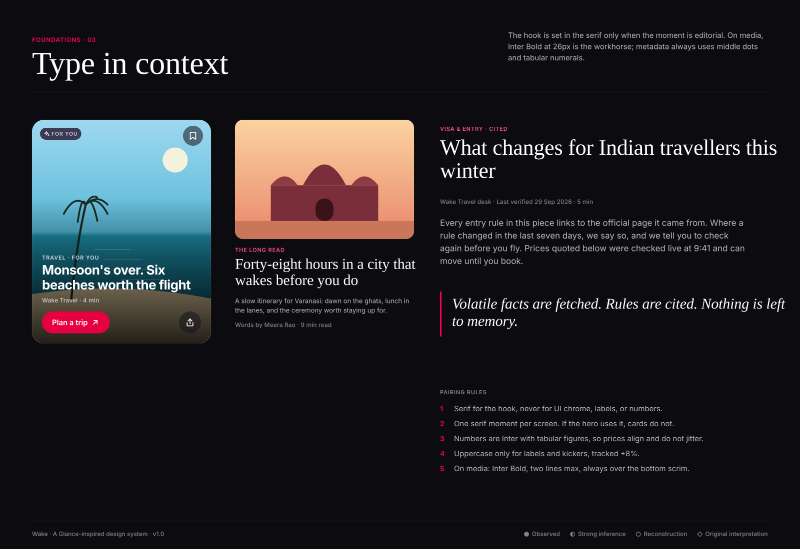

# Typography

● Observed · ◐ Strong inference · ○ Reconstruction · ◇ Original interpretation

## Families
| Role | Family | Why | Licence |
|---|---|---|---|
| Functional (UI, body, numbers) | **Inter** ○ | Glance's production face could not be identified from public sources. Inter is a neutral, highly legible grotesque with tabular figures and the ₹ glyph, close to the clean geometric sans that app-commerce products of this kind typically use. | SIL OFL |
| Editorial hook | **Instrument Serif** ◇ | Expresses the observed "fashion magazine starring you" positioning. Condensed, high-contrast serif that holds up at 40–72px. Original choice, not observed. | SIL OFL |

If you know the production face, change `--font-sans` in one place; the scale holds.

## Scale (mobile; desktop sizes in parentheses in `typography.json`)
| Token | Family | Weight | Size | Line height | Tracking | Max line | Usage | Conf. |
|---|---|---|---|---|---|---|---|---|
| `display-xl` | Instrument Serif | 400 | 56px | 1.0 | -0.01em | 18ch | Editorial hooks on cover media and deck titles. Desktop 72. | ◇ |
| `display` | Instrument Serif | 400 | 40px | 1.05 | -0.005em | 22ch | Section openers, onboarding statements. Desktop 56. | ◇ |
| `headline-media` | Inter | 700 | 26px | 1.15 | -0.02em | 40ch | Headline laid over imagery (lock-screen hook). Two lines max. | ◐ |
| `h1` | Inter | 700 | 30px | 1.15 | -0.02em | 32ch | Screen titles. Desktop 40. | ○ |
| `h2` | Inter | 700 | 22px | 1.2 | -0.015em | 40ch | Section headers, rail titles. | ○ |
| `h3` | Inter | 600 | 17px | 1.3 | -0.01em | 48ch | Card titles. | ○ |
| `body-l` | Inter | 400 | 17px | 1.5 | 0.0em | 64ch | Article body, onboarding copy. | ○ |
| `body` | Inter | 400 | 15px | 1.5 | 0.0em | 72ch | Default body copy. | ○ |
| `body-s` | Inter | 400 | 13px | 1.45 | 0.0em | 72ch | Descriptions inside cards. | ○ |
| `caption` | Inter | 500 | 12px | 1.35 | 0.0em | 60ch | Image credits, helper text. | ○ |
| `label` | Inter | 600 | 11px | 1.2 | 0.08em | 24ch | Kickers and category labels, uppercase. | ◐ |
| `button` | Inter | 600 | 15px | 1.0 | -0.005em | 24ch | Button and chip labels. | ○ |
| `metadata` | Inter | 500 | 12px | 1.3 | 0.01em | 48ch | Source · time · price facts, tabular numerals, middle-dot separated. | ◇ |

Desktop (≥1024px): display-xl 72 · display 56 · h1 40 · h2 28 · headline-media 32 · body-l 18.

## Rules
1. One serif moment per screen. Never serif for UI, numbers, labels.
2. Numbers are Inter with `font-variant-numeric: tabular-nums`.
3. Uppercase only for `label` (+0.08em).
4. On media: `headline-media`, 2 lines max, over `--scrim-bottom`.
5. Body line length 60–72 characters; captions ≤ 60.
6. Font files: see `fonts/` (Inter, Instrument Serif, OFL licences included).
