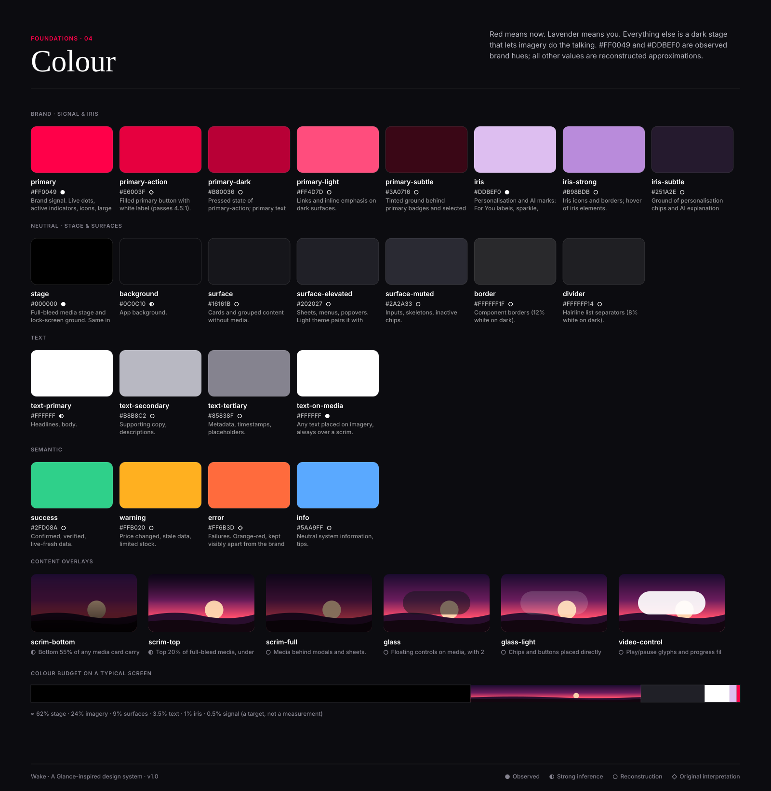

# Colour system

● Observed · ◐ Strong inference · ○ Reconstruction · ◇ Original interpretation

**Observed / reconstructed approximation.** #FF0049 and #DDBEF0 appear in a public brand registry for glance.com (source S3).
They are not taken from Glance's CSS and are not official values. Every other value is reconstructed or original.

## Meaning
- **Signal (red) means now:** the one action on a screen, live indicators. Budget ≈ 0.5% of pixels.
- **Iris (lavender) means you:** reasons, AI, personalisation, the assistant.
- **Stage and surfaces** are near-black so imagery supplies the colour.
- **Semantic** colours are distinct from the brand: success green (fresh, verified), warning amber (cached, changed), error orange-red.

## Tokens (dark default · light)
Contrast column = ratio against the theme background (dark / light).

| Token | Dark HEX | RGB | HSL | Light HEX | Contrast | Usage | Conf. |
|---|---|---|---|---|---|---|---|
| `--color-primary` | #FF0049 | rgb(255, 0, 73) | hsl(343, 100%, 50%) | #FF0049 | 4.97 / 3.93 | Brand signal. Live dots, active indicators, icons, large display accents. Never body text on light. | ● |
| `--color-primary-action` | #E6003F | rgb(230, 0, 63) | hsl(344, 100%, 45%) | #E6003F | 4.12 / 4.73 | Filled primary button with white label (passes 4.5:1). | ◇ |
| `--color-primary-dark` | #B80036 | rgb(184, 0, 54) | hsl(342, 100%, 36%) | #B80036 | 2.87 / 6.79 | Pressed state of primary-action; primary text on light surfaces. | ○ |
| `--color-primary-light` | #FF4D7D | rgb(255, 77, 125) | hsl(344, 100%, 65%) | #FF4D7D | 6.14 / 3.18 | Links and inline emphasis on dark surfaces. | ○ |
| `--color-primary-subtle` | #3A0716 | rgb(58, 7, 22) | hsl(342, 78%, 13%) | #FFE8EE | 1.14 / 1.16 | Tinted ground behind primary badges and selected chips. | ○ |
| `--color-iris` | #DDBEF0 | rgb(221, 190, 240) | hsl(277, 62%, 84%) | #7B4FA6 | 11.80 / 5.98 | Personalisation and AI marks: For You labels, sparkle, 'because you…' lines. | ● |
| `--color-iris-strong` | #B98BDB | rgb(185, 139, 219) | hsl(274, 53%, 70%) | #5E3786 | 7.23 / 8.87 | Iris icons and borders; hover of iris elements. | ○ |
| `--color-iris-subtle` | #251A2E | rgb(37, 26, 46) | hsl(273, 28%, 14%) | #F5EDFB | 1.18 / 1.14 | Ground of personalisation chips and AI explanation panels. | ○ |
| `--color-stage` | #000000 | rgb(0, 0, 0) | hsl(0, 0%, 0%) | #000000 | 1.08 / 21.00 | Full-bleed media stage and lock-screen ground. Same in both themes. | ● |
| `--color-background` | #0C0C10 | rgb(12, 12, 16) | hsl(240, 14%, 5%) | #FFFFFF | 1.00 / 1.00 | App background. | ◐ |
| `--color-surface` | #16161B | rgb(22, 22, 27) | hsl(240, 10%, 10%) | #F6F5F8 | 1.08 / 1.09 | Cards and grouped content without media. | ○ |
| `--color-surface-elevated` | #202027 | rgb(32, 32, 39) | hsl(240, 10%, 14%) | #FFFFFF | 1.21 / 1.00 | Sheets, menus, popovers. Light theme pairs it with shadow-2. | ○ |
| `--color-surface-muted` | #2A2A33 | rgb(42, 42, 51) | hsl(240, 10%, 18%) | #ECEBF0 | 1.37 / 1.19 | Inputs, skeletons, inactive chips. | ○ |
| `--color-border` | #FFFFFF1F | rgba(255, 255, 255, 0.12) | hsl(0, 0%, 100% / 0.12) | #E2E0E8 | 1.36 / 1.31 | Component borders (12% white on dark). | ○ |
| `--color-divider` | #FFFFFF14 | rgba(255, 255, 255, 0.08) | hsl(0, 0%, 100% / 0.08) | #EEEDF2 | 1.19 / 1.16 | Hairline list separators (8% white on dark). | ○ |
| `--color-text-primary` | #FFFFFF | rgb(255, 255, 255) | hsl(0, 0%, 100%) | #0C0C10 | 19.52 / 19.52 | Headlines, body. | ◐ |
| `--color-text-secondary` | #B8B8C2 | rgb(184, 184, 194) | hsl(240, 8%, 74%) | #55535E | 9.92 / 7.54 | Supporting copy, descriptions. | ○ |
| `--color-text-tertiary` | #85838F | rgb(133, 131, 143) | hsl(250, 5%, 54%) | #6B6975 | 5.24 / 5.38 | Metadata, timestamps, placeholders. | ○ |
| `--color-text-on-media` | #FFFFFF | rgb(255, 255, 255) | hsl(0, 0%, 100%) | #FFFFFF | 19.52 / 1.00 | Any text placed on imagery, always over a scrim. | ● |
| `--color-text-on-primary` | #FFFFFF | rgb(255, 255, 255) | hsl(0, 0%, 100%) | #FFFFFF | 19.52 / 1.00 | Label on primary-action. | ○ |
| `--color-success` | #2FD08A | rgb(47, 208, 138) | hsl(154, 63%, 50%) | #0A7F4A | 9.77 / 5.06 | Confirmed, verified, live-fresh data. | ○ |
| `--color-warning` | #FFB020 | rgb(255, 176, 32) | hsl(39, 100%, 56%) | #9A5B00 | 10.67 / 5.43 | Price changed, stale data, limited stock. | ○ |
| `--color-error` | #FF6B3D | rgb(255, 107, 61) | hsl(14, 100%, 62%) | #C2381A | 6.90 / 5.42 | Failures. Orange-red, kept visibly apart from the brand pink-red; always with an icon. | ◇ |
| `--color-info` | #5AA9FF | rgb(90, 169, 255) | hsl(211, 100%, 68%) | #1F63C7 | 7.95 / 5.73 | Neutral system information, tips. | ○ |

## Content overlays
| Token | Value | Usage | Conf. |
|---|---|---|---|
| `--scrim-bottom` | `linear-gradient(180deg, rgba(0,0,0,0) 0%, rgba(0,0,0,.35) 45%, rgba(0,0,0,.85) 100%)` | Bottom 55% of any media card carrying text. | ◐ |
| `--scrim-top` | `linear-gradient(180deg, rgba(0,0,0,.55) 0%, rgba(0,0,0,0) 100%)` | Top 20% of full-bleed media, under the status bar and chrome. | ◐ |
| `--scrim-full` | `rgba(0,0,0,.48)` | Media behind modals and sheets. | ○ |
| `--glass` | `rgba(22,22,27,.56)` | Floating controls on media, with 20px backdrop blur. | ○ |
| `--glass-light` | `rgba(255,255,255,.16)` | Chips and buttons placed directly on imagery. | ○ |
| `--video-control` | `rgba(255,255,255,.92)` | Play/pause glyphs and progress fill on video. | ○ |
| `--video-track` | `rgba(255,255,255,.32)` | Progress track on video and story bars. | ○ |
| `--media-ground` | `#000000` | Letterbox and loading ground for media. | ● |
| `--signal-glow` | `rgba(255,0,73,.35)` | Glow under the single floating action. Nowhere else. | ◇ |

## Light / dark behaviour
Dark is default (`:root`). Light is `[data-theme="light"]`. Brand hues, stage, scrims, media overlays and text-on-media are identical in
both themes; neutrals invert; iris and semantic colours darken in light for contrast. See [light-theme.svg](light-theme.svg),
[dark-theme.svg](dark-theme.svg).

## Contrast guidance
- Body text: `text-primary` / `text-secondary` only.
- `text-tertiary`: metadata ≥ 12px only.
- `primary` as text: dark theme only, ≥ 15px semibold. On light use `primary-dark`.
- Filled buttons: `primary-action` (4.73:1 with white), never `primary`.
