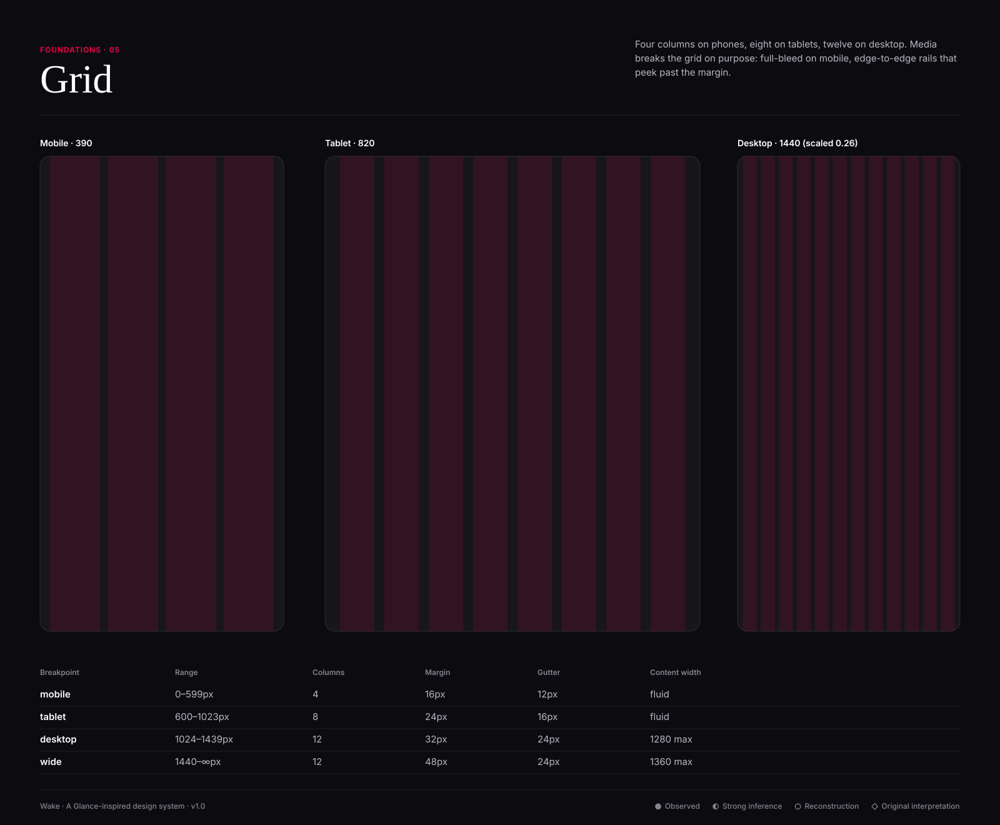
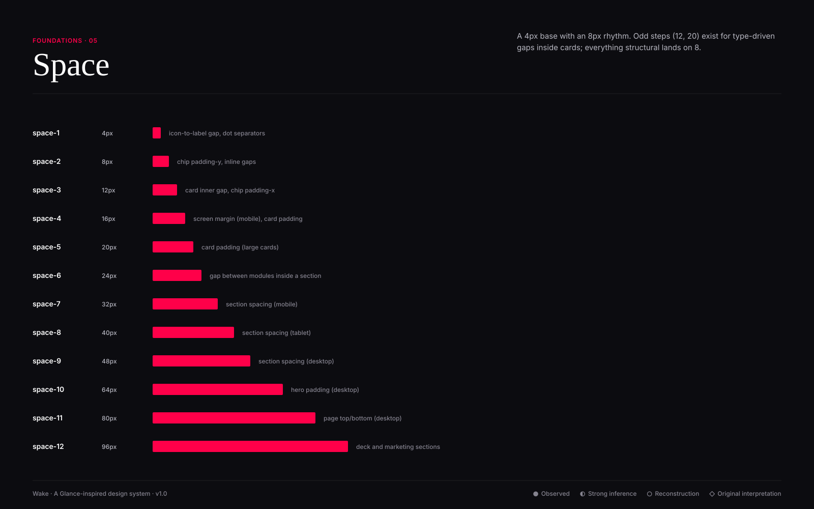
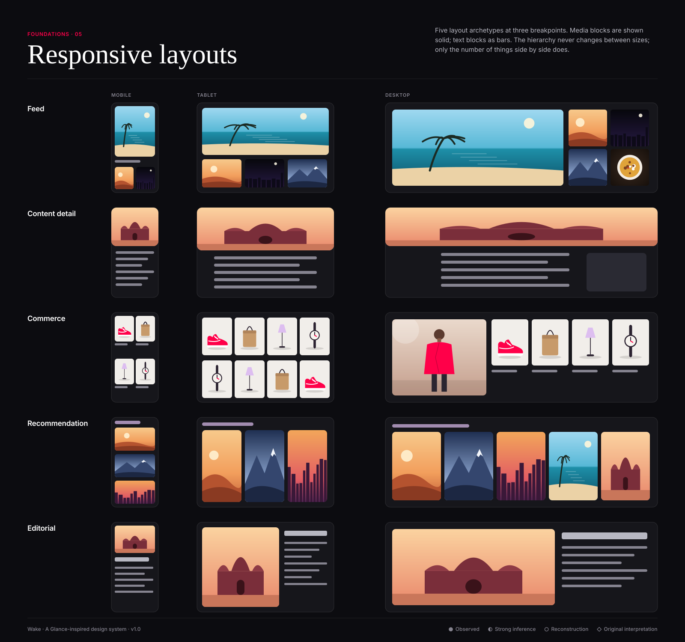

# Layout system

  

● Observed · ◐ Strong inference · ○ Reconstruction · ◇ Original interpretation

## Spacing ○
Base unit **4px**, structural rhythm **8px**.

| Token | Value | Use |
|---|---|---|
| `--space-0` | 0px |  |
| `--space-1` | 4px | icon-to-label gap, dot separators |
| `--space-2` | 8px | chip padding-y, inline gaps |
| `--space-3` | 12px | card inner gap, chip padding-x |
| `--space-4` | 16px | screen margin (mobile), card padding |
| `--space-5` | 20px | card padding (large cards) |
| `--space-6` | 24px | gap between modules inside a section |
| `--space-7` | 32px | section spacing (mobile) |
| `--space-8` | 40px | section spacing (tablet) |
| `--space-9` | 48px | section spacing (desktop) |
| `--space-10` | 64px | hero padding (desktop) |
| `--space-11` | 80px | page top/bottom (desktop) |
| `--space-12` | 96px | deck and marketing sections |

| Layout value | Mobile | Tablet | Desktop |
|---|---|---|---|
| Screen margin | 16 | 24 | 32 (48 wide) |
| Gutter | 12 | 16 | 24 |
| Section gap | 32 | 40 | 48 |
| Card padding | 16 (20 hero) | 20 | 24 |
| Rail card gap | 12 | 12 | 16 |

## Grid and breakpoints ○
| Breakpoint | Range | Columns | Margin | Gutter | Content |
|---|---|---|---|---|---|
| mobile | 0–599 | 4 | 16 | 12 | fluid |
| tablet | 600–1023 | 8 | 24 | 16 | fluid |
| desktop | 1024–1439 | 12 | 32 | 24 | 1280 max |
| wide | 1440–∞ | 12 | 48 | 24 | 1360 max |

## Card widths
| Card | Mobile | Tablet | Desktop |
|---|---|---|---|
| A hero | 100% − margins (4:5) | 100% (16:9) | 8/12 cols (16:9) |
| B standard | 171 (2-up) / 240 (rail) | 3-up | 4–5 up |
| C compact | 100% | 50% | 4/12 cols |
| D commerce | 171 (2-up) | 4-up | 5–6 up |
| E recommendation | 240 (rail) | 240 | 218–240 |
| F editorial | 100% | 100% | 6/12 cols |

## Layout archetypes
Feed · Content detail · Commerce · Recommendation · Editorial — see [responsive-layouts.svg](responsive-layouts.svg). Media breaks the
grid deliberately: heroes go full-bleed on mobile; rails bleed past the right margin to show a peek.
