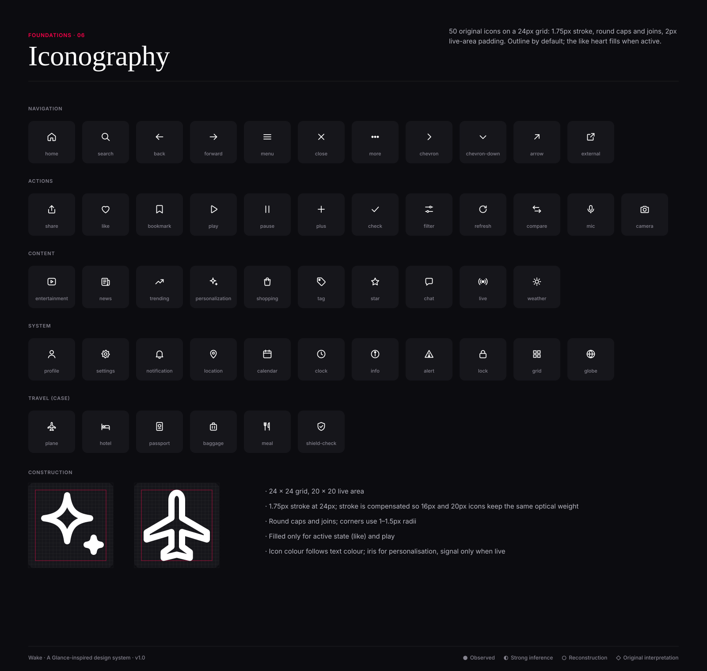

# Icon guidelines

● Observed · ◐ Strong inference · ○ Reconstruction · ◇ Original interpretation — the icon set is **◇ original**; Glance's icons are not documented publicly.

- **Grid:** 24 × 24, live area 20 × 20 (2px padding).
- **Stroke:** 1.75px, round caps, round joins. At 16/20px the stroke is compensated to keep optical weight.
- **Corners:** 1–1.5px radii on rectangles; no sharp outer corners except arrows.
- **Style:** outline. Fill only for active states (liked heart, play). Dots use filled circles r=1.6.
- **Colour:** inherits text colour (`currentColor`). Iris for personalisation, signal only for live.
- **Sizes:** 16 (chips, badges) · 20 (inputs, dense rows) · 24 (nav, default) · 32 (deck).
- **Files:** individual SVGs in `svg/` (50 icons); sprite in `11_SVG_ASSETS/icons/sprite.svg` (`<use href="#i-home"/>`).

| Group | Icons |
|---|---|
| Navigation | home, search, back, forward, menu, close, more, chevron, chevron-down, arrow, external |
| Actions | share, like, bookmark, play, pause, plus, check, filter, refresh, compare, mic, camera |
| Content | entertainment, news, trending, personalization, shopping, tag, star, chat, live, weather |
| System | profile, settings, notification, location, calendar, clock, info, alert, lock, grid, globe |
| Travel (case) | plane, hotel, passport, baggage, meal, shield-check |

**Do:** pair icons with labels in navigation. **Don't:** mix with third-party icon sets; don't scale strokes arbitrarily.
