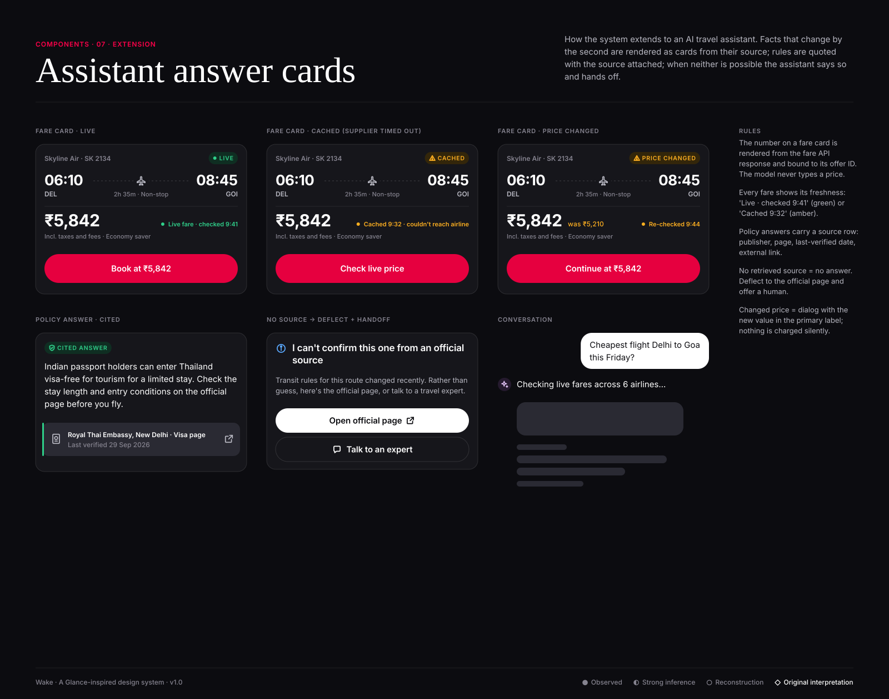

# Assistant answer cards (extension)

**Confidence:** ◇ original interpretation. This folder shows how the Glance-inspired system extends to a conversational travel assistant,
the product in the case study. Glance's own roadmap mentions expanding the AI commerce platform to travel (press release, 2025), but no
travel UI is public, so nothing here is observed.

| Component | Purpose | Key rule |
|---|---|---|
| Fare card (live) | Show a flight option and price | Price rendered from the fare API response, bound to an offer ID; "Live · checked HH:MM" in success |
| Fare card (cached) | Supplier timed out or rate-limited | Amber "Cached" badge + timestamp; CTA becomes "Check live price", never "Book" |
| Fare card (changed) | Price moved between quote and decision | Amber "Price changed" + was-price; confirm via dialog |
| Policy answer (cited) | Visa, baggage, refund rules | Answer text constrained to the retrieved snippet; source row with publisher + last-verified date + link |
| Deflect card | No source found or source changed recently | Says so plainly; secondary button to the official page; tertiary to a human |
| Conversation | User bubble (inverse), assistant line (iris avatar), skeleton while checking | "Checking live fares…" state covers the 1–2s supplier latency |

These map one-to-one to the case plan: Option A (live price + fallback), Option B (cite-or-deflect) and the human handoff.
