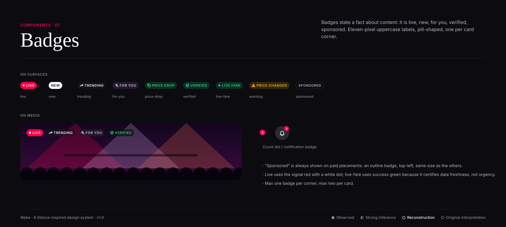

# Badges

**Confidence:** ◐ "Live", "Trending" and category labels over content are strongly inferred from Glance's lock-screen and live-content
surfaces; the iris "For you" and green "Live fare / Verified" badges are ◇ original interpretation.

| Kind | Colour | Icon/dot | Meaning |
|---|---|---|---|
| live | primary fill, white | white dot, pulses 1600ms | Happening now |
| new | white fill | — | Added in the last 24h |
| trending | glass | trending | Velocity, not volume |
| for-you | iris-subtle / iris | sparkle | Selected by personalisation |
| price-drop | success-subtle | tag | Price lower than last seen |
| verified | success-subtle | shield-check | Answer is backed by a cited source |
| live-fare | success-subtle | dot | Price fetched live; carries a timestamp |
| warning | warning-subtle | alert | Price changed / data is cached |
| sponsored | outline | — | Paid placement. Mandatory on ads |

**Spec:** height 22 (24 on hero), padding-x 8, label 10.5–11/600 uppercase +8% tracking, pill radius, 4px from the card corner at 12–16px inset.

**Do:** pair any time-sensitive badge with a timestamp in metadata. **Don't:** use badges as buttons; stack three badges; show "Live" on anything not live.
