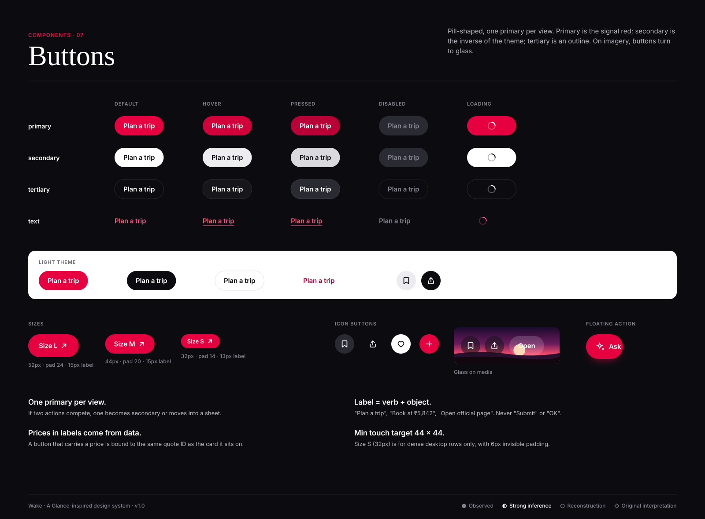

# Buttons

**Confidence:** ◐ pill shape and a single red primary CTA are strongly inferred from public Glance surfaces ("Download The App", one-tap
"Glance it. Shop it."). Exact sizes, states and the inverse secondary are ○ reconstruction.

| Variant | Use | Dark | Light |
|---|---|---|---|
| Primary | The one action that moves the user forward | `--color-primary-action` fill, white label (4.73:1) | same |
| Secondary | Strong alternative, or primary on a screen that already has a red element | white fill, `#0C0C10` label | `#0C0C10` fill, white label |
| Tertiary | Low-emphasis alternatives, "Share", "Not now" | 1px `--color-border`, text-primary | same |
| Text action | Inline "See all", "Undo" | `--color-primary-light` | `--color-primary-dark` |
| Icon button | Save, share, close | 44px circle, `surface-muted` or glass on media | |
| Floating action | "Ask" — the assistant entry point. One per app. | primary-action + `shadow-signal` | |

## Sizes
| Size | Height | Padding-x | Label | Icon |
|---|---|---|---|---|
| L | 52 | 24 | 15/600 | 18 |
| M | 44 | 20 | 15/600 | 18 |
| S | 32 | 14 | 13/600 | 16 |

## States
Default → hover (`#D1003A`, darker, keeps AA) → pressed (`--color-primary-dark`, scale .97, 100ms) → disabled (`surface-muted`, tertiary text,
no pointer) → loading (label replaced by a 16px spinner; width locked so the layout does not jump).

## Do
- One primary per view; the red is a scarce resource.
- Put the price in the label when the button commits money: "Book at ₹5,842".
- Switch to glass variants on imagery.

## Don't
- Don't use the brand red for destructive actions (use a tertiary button with `--color-error` text and an icon).
- Don't stack two primaries. Don't use ALL CAPS labels.
- Don't write a price into a label by hand: bind it to the same fare/quote ID as the card.
