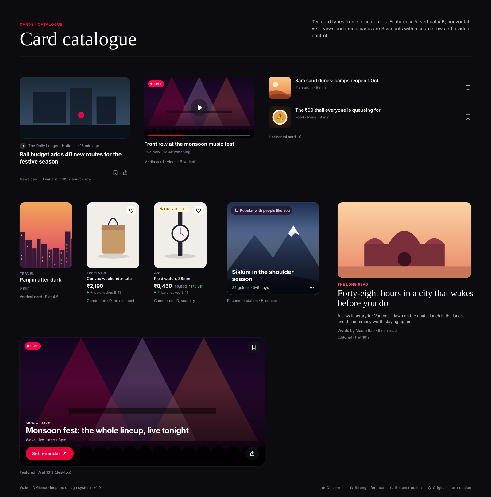

# Cards

Cards are the system's main unit. Six anatomies (A–F) cover every card type; the catalogue shows how news, media, featured,
horizontal and vertical cards derive from them.

| Card | File | Anatomy | Job |
|---|---|---|---|
| A · Large hero | [card-a-hero.md](card-a-hero.md) | media full-bleed + scrim + text on media + CTA | The one thing that matters now |
| B · Standard | [card-b-standard.md](card-b-standard.md) | media on top, text on ground | Default feed unit |
| C · Compact | [card-c-compact.md](card-c-compact.md) | thumb + two lines | Lists, trending, results |
| D · Commerce | [card-d-commerce.md](card-d-commerce.md) | product image + brand + price row + freshness | Anything purchasable |
| E · Recommendation | [card-e-recommendation.md](card-e-recommendation.md) | full-bleed + iris reason chip | Anything chosen by personalisation |
| F · Editorial | [card-f-editorial.md](card-f-editorial.md) | media + serif headline + dek | Long reads, guides |

## Card system rules
- **Image-to-text ratio:** media takes 60–75% of the card's area on B, D, F and 100% on A, E. Text never exceeds 3 lines.
- **Aspect ratios:** 4:5 people/products, 3:2 places/editorial, 16:9 video/news, 3:4 recommendation, 1:1 thumbnails.
- **Radius:** 24 hero · 16 standard · 12 compact thumb · 0 full-bleed.
- **Overlay:** text on media only over `--scrim-bottom`; controls on media are glass.
- **Metadata:** one line, middle-dot separated, tabular numerals, text-tertiary (72% white on media).
- **CTA placement:** only Card A carries a button. Every other card is itself the tap target.
- **Density:** mobile shows 1 hero + ~1.5 rail cards above the fold, never more than 4 distinct things.
- **Hierarchy:** A > F > E > B/D > C. One A and at most one F per screen.
