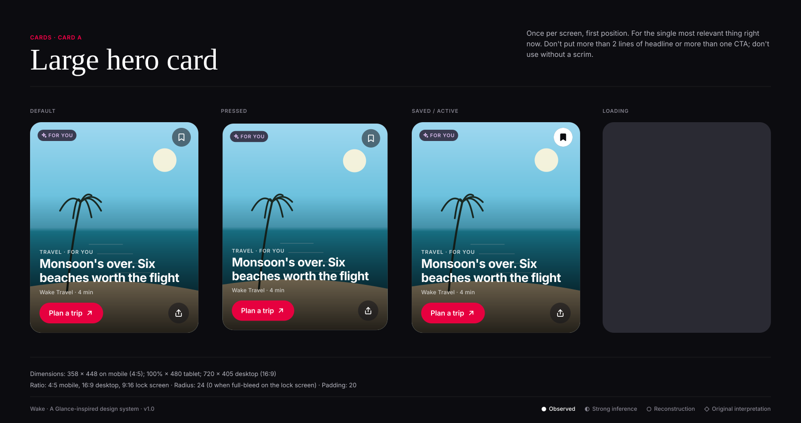
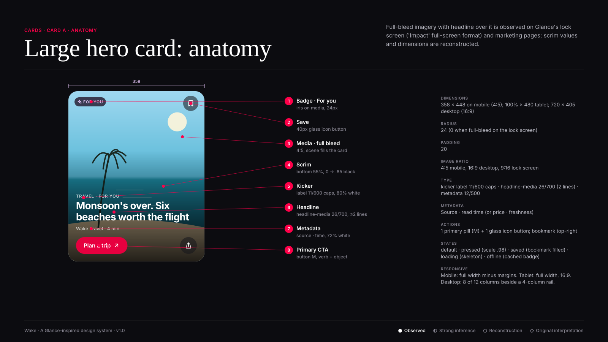

# Card A · Large hero card

**Confidence:** ● Observed — Full-bleed imagery with headline over it is observed on Glance's lock screen ('Impact' full-screen format) and marketing pages; scrim values and dimensions are reconstructed.

| Property | Value |
|---|---|
| Dimensions | 358 × 448 on mobile (4:5); 100% × 480 tablet; 720 × 405 desktop (16:9) |
| Padding | 20 |
| Radius | 24 (0 when full-bleed on the lock screen) |
| Image ratio | 4:5 mobile, 16:9 desktop, 9:16 lock screen |
| Typography | kicker label 11/600 caps · headline-media 26/700 (2 lines) · metadata 12/500 |
| Metadata | Source · read time (or price · freshness) |
| Actions | 1 primary pill (M) + 1 glass icon button; bookmark top-right |
| States | default · pressed (scale .98) · saved (bookmark filled) · loading (skeleton) · offline (cached badge) |
| Responsive | Mobile: full width minus margins. Tablet: full width, 16:9. Desktop: 8 of 12 columns beside a 4-column rail. |

**Use:** Once per screen, first position. For the single most relevant thing right now.

**Don't:** Don't put more than 2 lines of headline or more than one CTA; don't use without a scrim.

**Tokens:** `--radius-xl`, `--scrim-bottom`, `--type-headline-media-*`,
`--color-text-tertiary` (metadata), `--color-primary-action`.
