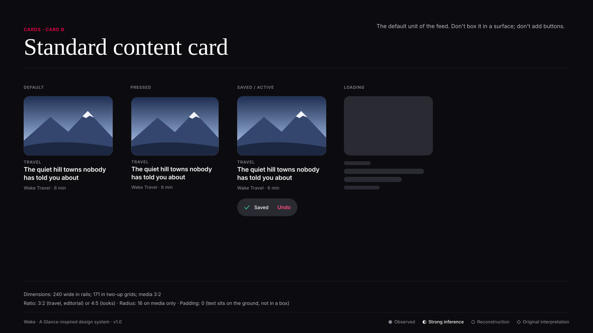
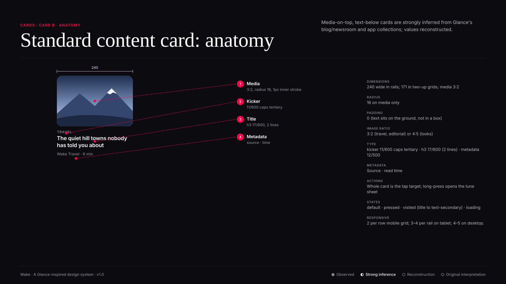

# Card B · Standard content card

**Confidence:** ◐ Strong inference — Media-on-top, text-below cards are strongly inferred from Glance's blog/newsroom and app collections; values reconstructed.

| Property | Value |
|---|---|
| Dimensions | 240 wide in rails; 171 in two-up grids; media 3:2 |
| Padding | 0 (text sits on the ground, not in a box) |
| Radius | 16 on media only |
| Image ratio | 3:2 (travel, editorial) or 4:5 (looks) |
| Typography | kicker 11/600 caps tertiary · h3 17/600 (2 lines) · metadata 12/500 |
| Metadata | Source · read time |
| Actions | Whole card is the tap target; long-press opens the tune sheet |
| States | default · pressed · visited (title to text-secondary) · loading |
| Responsive | 2 per row mobile grid; 3–4 per rail on tablet; 4–5 on desktop. |

**Use:** The default unit of the feed.

**Don't:** Don't box it in a surface; don't add buttons.

**Tokens:** `--radius-l`, `--scrim-bottom`, `--type-h3-*`,
`--color-text-tertiary` (metadata), `--color-primary-action`.
