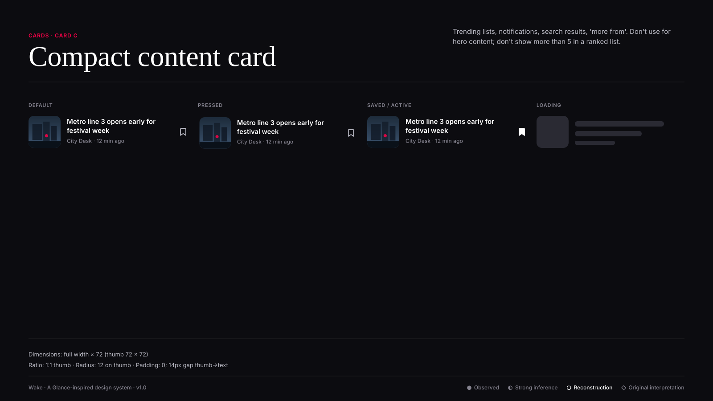
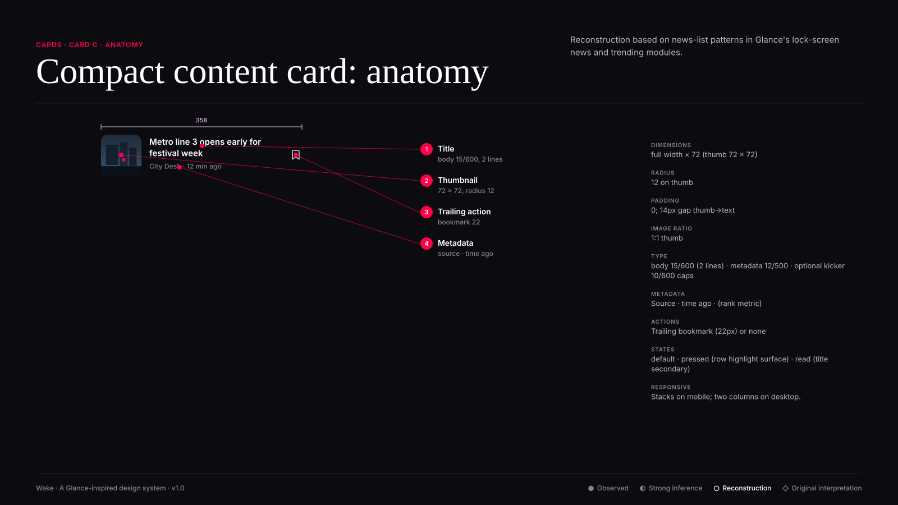

# Card C · Compact content card

**Confidence:** ○ Reconstruction — Reconstruction based on news-list patterns in Glance's lock-screen news and trending modules.

| Property | Value |
|---|---|
| Dimensions | full width × 72 (thumb 72 × 72) |
| Padding | 0; 14px gap thumb→text |
| Radius | 12 on thumb |
| Image ratio | 1:1 thumb |
| Typography | body 15/600 (2 lines) · metadata 12/500 · optional kicker 10/600 caps |
| Metadata | Source · time ago · (rank metric) |
| Actions | Trailing bookmark (22px) or none |
| States | default · pressed (row highlight surface) · read (title secondary) |
| Responsive | Stacks on mobile; two columns on desktop. |

**Use:** Trending lists, notifications, search results, 'more from'.

**Don't:** Don't use for hero content; don't show more than 5 in a ranked list.

**Tokens:** `--radius-m`, `--scrim-bottom`, `--type-h3-*`,
`--color-text-tertiary` (metadata), `--color-primary-action`.
