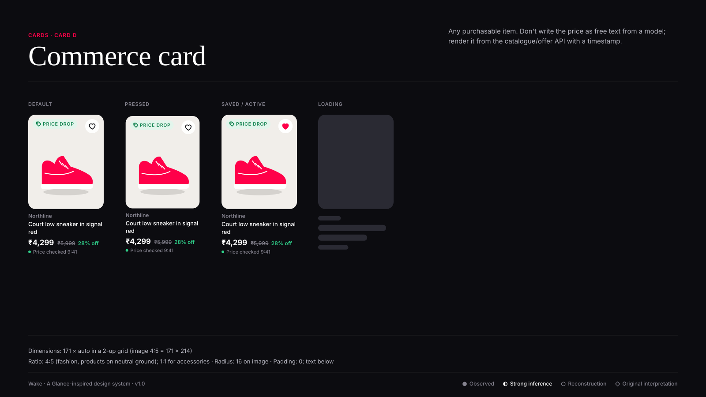
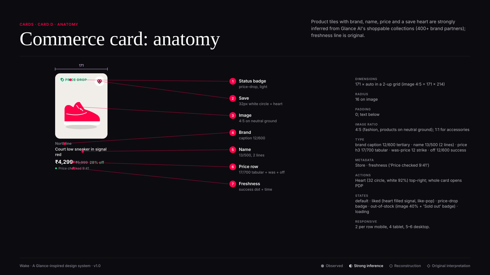

# Card D · Commerce card

**Confidence:** ◐ Strong inference — Product tiles with brand, name, price and a save heart are strongly inferred from Glance AI's shoppable collections (400+ brand partners); freshness line is original.

| Property | Value |
|---|---|
| Dimensions | 171 × auto in a 2-up grid (image 4:5 = 171 × 214) |
| Padding | 0; text below |
| Radius | 16 on image |
| Image ratio | 4:5 (fashion, products on neutral ground); 1:1 for accessories |
| Typography | brand caption 12/600 tertiary · name 13/500 (2 lines) · price h3 17/700 tabular · was-price 12 strike · off 12/600 success |
| Metadata | Store · freshness ('Price checked 9:41') |
| Actions | Heart (32 circle, white 92%) top-right; whole card opens PDP |
| States | default · liked (heart filled signal, like-pop) · price-drop badge · out-of-stock (image 40% + 'Sold out' badge) · loading |
| Responsive | 2 per row mobile, 4 tablet, 5–6 desktop. |

**Use:** Any purchasable item.

**Don't:** Don't write the price as free text from a model; render it from the catalogue/offer API with a timestamp.

**Tokens:** `--radius-l`, `--scrim-bottom`, `--type-h3-*`,
`--color-text-tertiary` (metadata), `--color-primary-action`.
