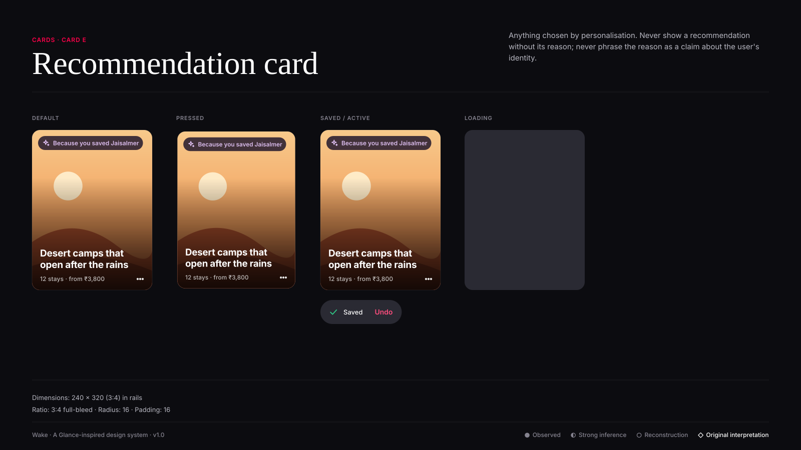
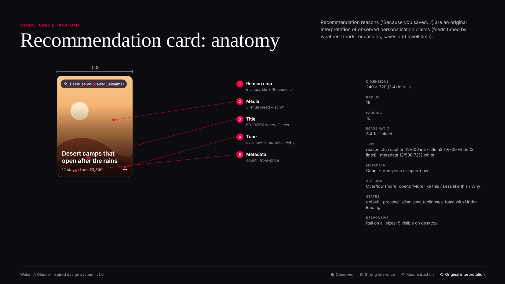

# Card E · Recommendation card

**Confidence:** ◇ Original interpretation — Recommendation reasons ('Because you saved…') are an original interpretation of observed personalisation claims (feeds tuned by weather, trends, occasions, saves and dwell time).

| Property | Value |
|---|---|
| Dimensions | 240 × 320 (3:4) in rails |
| Padding | 16 |
| Radius | 16 |
| Image ratio | 3:4 full-bleed |
| Typography | reason chip caption 12/600 iris · title h3 19/700 white (3 lines) · metadata 12/500 72% white |
| Metadata | Count · from-price or open-now |
| Actions | Overflow (more) opens 'More like this / Less like this / Why' |
| States | default · pressed · dismissed (collapses, toast with Undo) · loading |
| Responsive | Rail on all sizes; 5 visible on desktop. |

**Use:** Anything chosen by personalisation.

**Don't:** Never show a recommendation without its reason; never phrase the reason as a claim about the user's identity.

**Tokens:** `--radius-l`, `--scrim-bottom`, `--type-h3-*`,
`--color-text-tertiary` (metadata), `--color-iris`.
