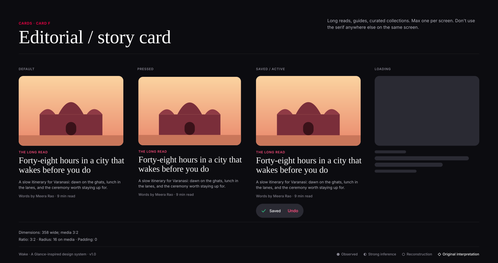
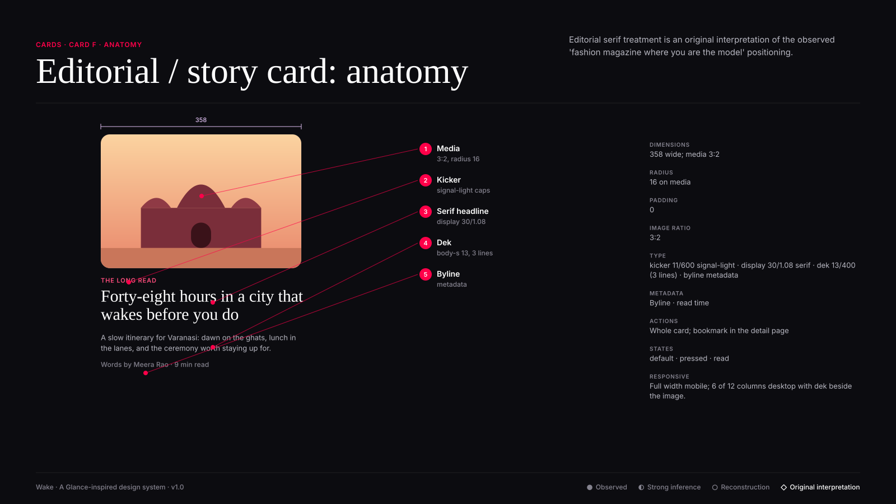

# Card F · Editorial / story card

**Confidence:** ◇ Original interpretation — Editorial serif treatment is an original interpretation of the observed 'fashion magazine where you are the model' positioning.

| Property | Value |
|---|---|
| Dimensions | 358 wide; media 3:2 |
| Padding | 0 |
| Radius | 16 on media |
| Image ratio | 3:2 |
| Typography | kicker 11/600 signal-light · display 30/1.08 serif · dek 13/400 (3 lines) · byline metadata |
| Metadata | Byline · read time |
| Actions | Whole card; bookmark in the detail page |
| States | default · pressed · read |
| Responsive | Full width mobile; 6 of 12 columns desktop with dek beside the image. |

**Use:** Long reads, guides, curated collections. Max one per screen.

**Don't:** Don't use the serif anywhere else on the same screen.

**Tokens:** `--radius-l`, `--scrim-bottom`, `--type-display-*`,
`--color-text-tertiary` (metadata), `--color-primary-action`.
