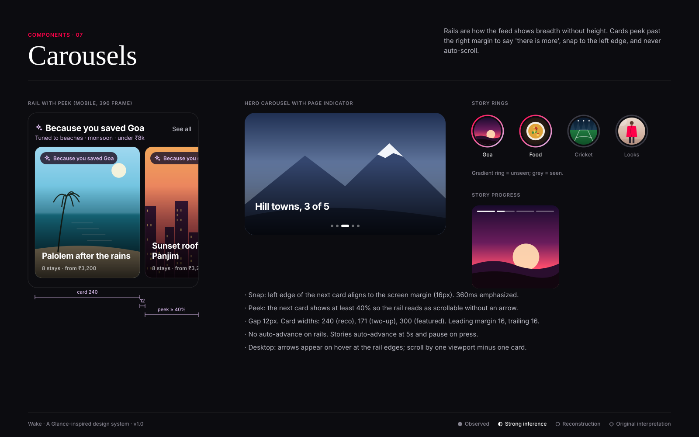

# Carousels

**Confidence:** ● horizontal swiping between stories is observed on the Glance lock screen; ◐ rails and peeking cards are strongly inferred
from Glance AI's scrollable looks and collections; exact dimensions ○ reconstructed.

| Type | Card | Behaviour |
|---|---|---|
| Recommendation rail | Card E, 240 × 300 | Horizontal scroll, snap-start, 12 gap, ≥40% peek |
| Two-up rail | Card B/D, 171 wide | Same; used for products and quick reads |
| Hero carousel | Card A, full width | Page dots (active 18 × 6 pill), swipe only, no autoplay |
| Story rings | 72px ring, 62px media | Gradient ring (signal → iris) = unseen |
| Story viewer | 9:16 full-bleed | Progress bars at top, 5s auto-advance, tap left/right, hold to pause |

**Accessibility:** rails are lists (`role="list"`), every card is reachable by keyboard; on desktop show previous/next buttons;
auto-advance respects `prefers-reduced-motion`.
