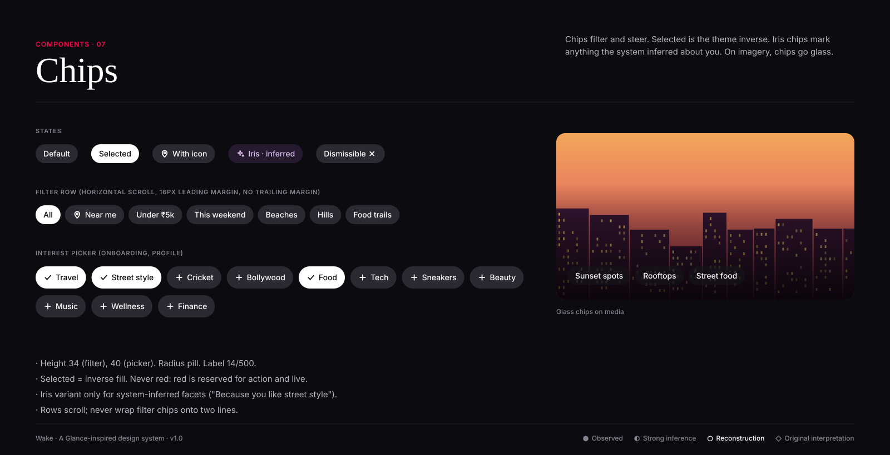

# Chips

**Confidence:** ○ reconstruction. Category filtering by horizontal tabs/rows is ● observed on the lock-screen news surface (For You,
Business, Sports… tabs); chip styling is reconstructed.

| Variant | Fill | Label | When |
|---|---|---|---|
| Default | `surface-muted` | text-primary 14/500 | Available filter |
| Selected | theme inverse (white on dark) | inverse | Active filter; add a check icon in multi-select |
| Iris | `iris-subtle` | `iris` + sparkle | The system inferred this facet from behaviour |
| Glass | `rgba(22,22,27,.56)` | white | Chips placed on imagery |
| Dismissible | default + 14px close | | Applied filters in search |

**Anatomy:** 34px height · 14px side padding · 16px icon · 6–8px icon gap · pill radius · 8px gap between chips.

**Do:** keep labels to 1–3 words; lead with the most-used filter; use iris only for inferred facets.
**Don't:** use red for selection; wrap a filter row; mix iris and default chips in the same group without a header explaining why.
