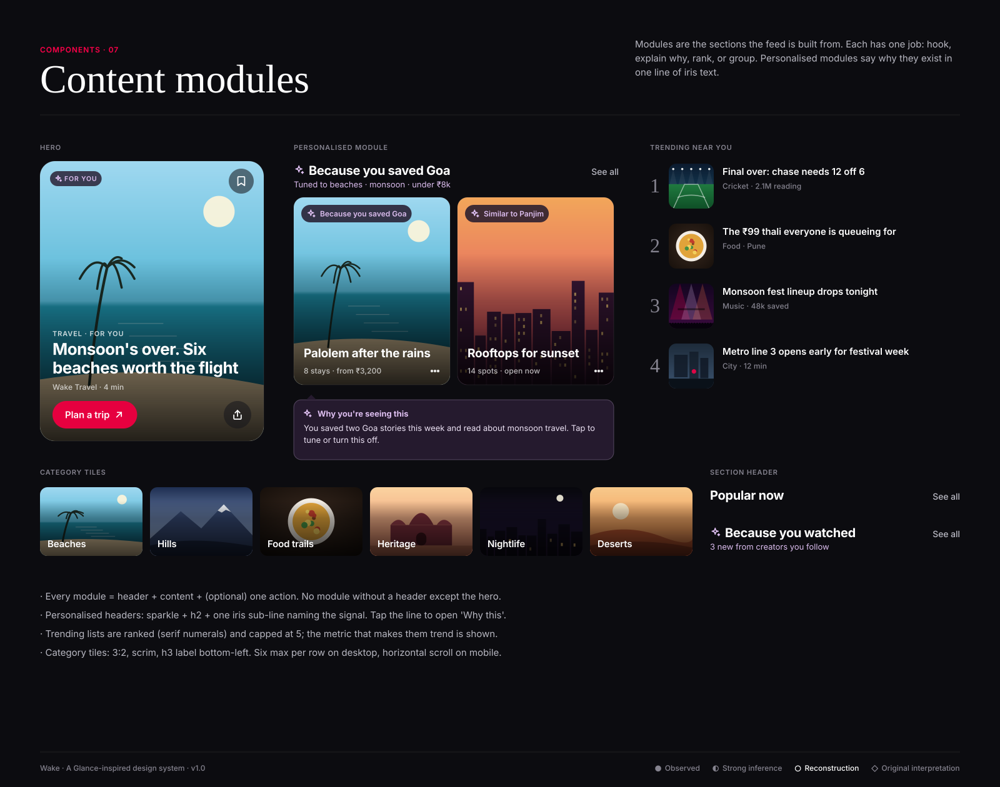

# Content modules

**Confidence:** ◐ feed made of topical sections, trending and "For you" content is strongly inferred (Glance lock-screen playlists,
Glance AI trend-driven feeds); module anatomy is ○ reconstruction; the iris explanation line is ◇ original.

| Module | Built from | Rule |
|---|---|---|
| Hero | Card A | One per screen, first position. Changes by time of day. |
| Section header | h2 + optional iris sub-line + "See all" | Title says what, sub-line says why |
| Recommendation rail | Card E × n | Must carry a reason ("Because you saved Goa") |
| Featured content | Card F | Editorial pick; serif headline allowed |
| Trending | Card C with rank | Max 5, shows the trend metric |
| Category tiles | 3:2 media + scrim + label | Entry points into discovery |
| Personalised module | Header with sparkle + tooltip "Why this" | User can tune or hide it in one tap |

**Ordering on a home feed:** Hero → personalised rail → trending → category tiles → editorial → second rail. Utility modules
(weather, live score, fare alert) are inserted only when their data changes (see patterns/notification.md).
