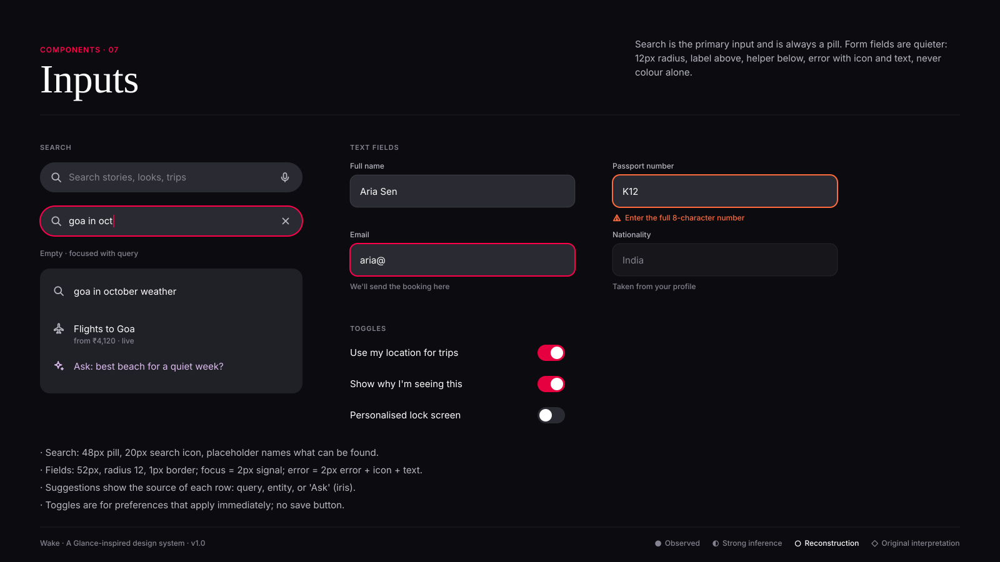

# Inputs

**Confidence:** ◐ natural-language and visual search is ● observed as a Glance AI capability ("Smart search beyond keywords"); field styling ○ reconstructed.

## Search field
48px height · pill · `surface-muted` fill · 20px icon at 16px inset · placeholder in text-tertiary · mic on the right when empty,
clear (×) when filled · focus ring 2px `--color-primary`. Suggestions list in `surface-elevated`, 16px radius, 60px rows; the last
row is always an iris "Ask" row that hands the query to the assistant.

## Text field
Label (caption, text-secondary) 10px above · 52px field · radius 12 · 16px padding · helper (caption) 8px below.
States: default (1px border) · focus (2px primary) · error (2px error + alert icon + message) · disabled (surface, tertiary text).

## Toggle
44 × 26, knob 20. On = primary-action. Changes apply instantly and are confirmed with a toast if they affect what the user sees.

**Do:** say what the error is and how to fix it. **Don't:** rely on red borders alone; don't disable the submit button without saying why.
