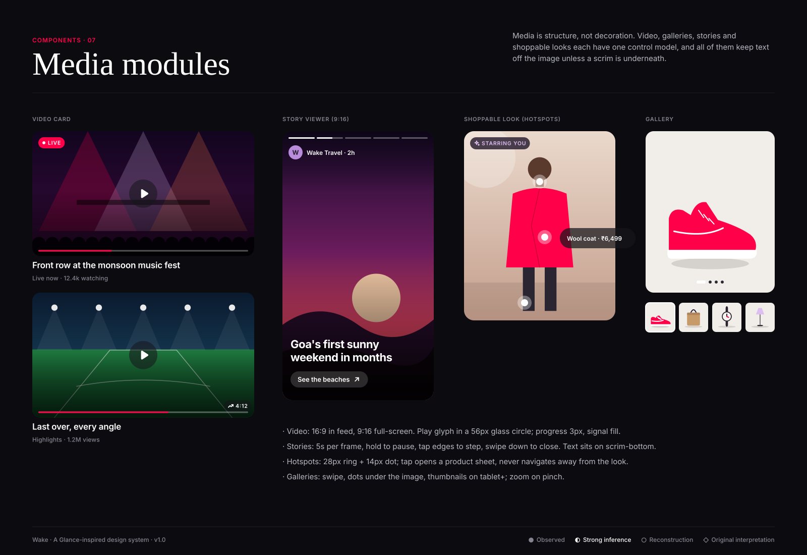

# Media modules

**Confidence:** ● full-screen imagery and video formats are observed (Glance's "Impact" full-screen and "Engagement" video formats;
AI looks set as wallpaper). ◐ story-style progress and hotspots are strongly inferred; specs are ○ reconstructed.

| Module | Ratio | Controls | Notes |
|---|---|---|---|
| Video card | 16:9 | 56px glass play, 3px progress, LIVE or duration badge | Muted autoplay only on Wi-Fi and only when 60% visible |
| Story viewer | 9:16 | progress bars, tap-step, hold-pause, swipe-down close | Max 7 frames per story |
| Shoppable look | 4:5 | hotspots (28/14), product sheet | "Starring you" iris badge when the image uses the user's likeness |
| Gallery | 1:1 / 4:5 | dots, thumbnails ≥ 600px | Pinch zoom; first image is the product on neutral ground |

**Likeness rule (◇):** any image generated with the user's photo carries the "Starring you" badge and a menu item to delete it.
