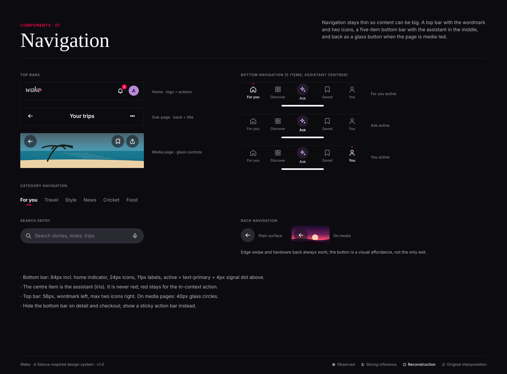

# Navigation

**Confidence:** ◐ minimal chrome and topic tabs are strongly inferred from Glance surfaces (the lock screen has no navigation at all;
the app is feed-led). The five-item bar with a centred assistant is ◇ original interpretation, motivated by Glance's chat-based styling
refinement and "Hey Siri, let's Glance" entry points.

| Element | Spec | Notes |
|---|---|---|
| Top bar | 56px; wordmark (display italic 24) left; ≤2 icon buttons right (40px) | Notification bell carries a count badge |
| Sub-page bar | back (40px) + centred h3 title + one overflow | |
| Media top bar | glass 40px circles over `scrim-top` | Used on detail, story, product |
| Bottom nav | 84px incl. home indicator; 5 items; 24px icons; 11/600 labels | Items: For you · Discover · Ask · Saved · You |
| Category nav | category tabs (see tabs) directly under the top bar | Scrolls away with the feed; tabs re-appear on scroll-up |
| Search entry | 48px pill at the top of Discover | Tapping opens the search screen with recent + suggestions |
| Back | glass on media, plain elsewhere; edge-swipe always available | |

**Do:** let the feed scroll under a translucent bottom bar. **Don't:** add a hamburger menu; don't put more than one red element in the chrome.
