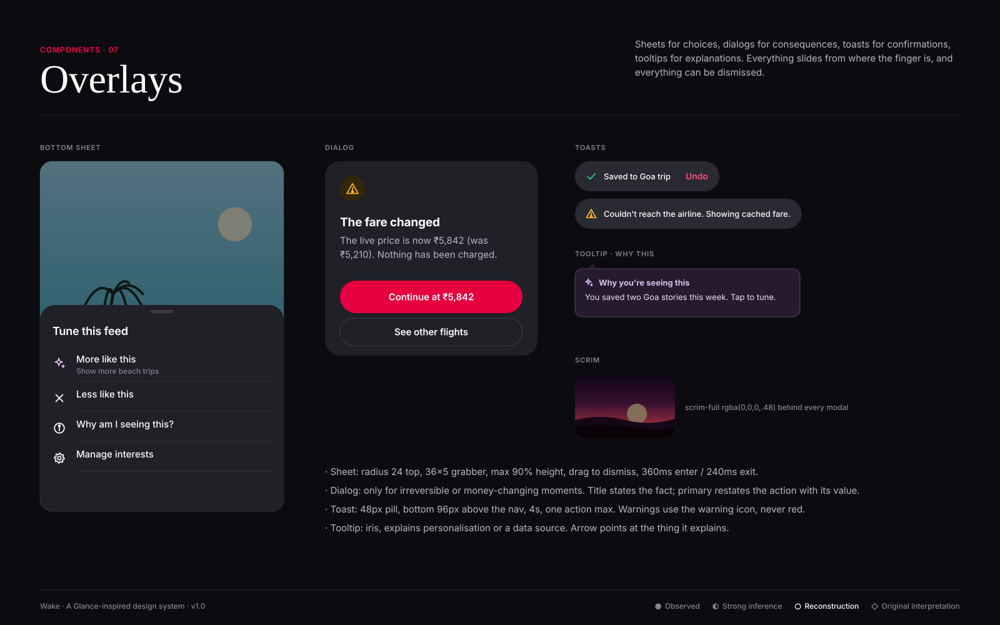

# Overlays

**Confidence:** ○ reconstruction throughout; the "Why am I seeing this" tooltip is ◇ original, added because personalisation transparency
is weak on today's surfaces (public reviews complain about the lock-screen experience being hard to control).

| Overlay | When | Spec |
|---|---|---|
| Bottom sheet | Choices about the current content (tune, share, sizes) | `surface-elevated`, radius 24 top, grabber, rows 48–56px |
| Dialog | Irreversible or money-changing consequence | 340 wide, radius 24, icon + h3 + body + stacked buttons |
| Toast | Confirmation or soft failure | 48px pill, 4s, one action |
| Tooltip | Explain personalisation or a data source | iris-subtle, radius 12, arrow |
| Scrim | Behind sheets and dialogs | rgba(0,0,0,.48), fades 240ms |

**Do:** make the dialog's primary button repeat the value ("Continue at ₹5,842"). **Don't:** use a dialog for marketing; don't stack overlays.
