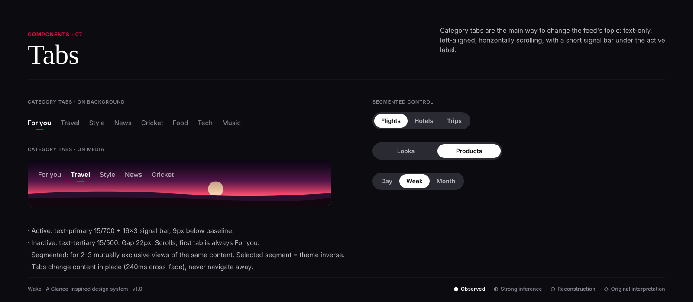

# Tabs

**Confidence:** ● observed — Glance's lock-screen news uses a row of topical tabs starting with "For You" (For You, Business, Sports,
National, International, Entertainment, Travel & Lifestyle…). Visual treatment (signal bar, weights) is ○ reconstruction.

| Type | Use | Spec |
|---|---|---|
| Category tabs | Switch the feed topic | 15px, active 700 + 16×3 primary bar, inactive 500 tertiary, 22px gap, horizontal scroll |
| Category tabs on media | Top of a full-bleed feed | White / 64% white, over `scrim-top` |
| Segmented control | 2–3 views of the same set (Flights / Hotels / Trips) | 40px pill track in surface-muted, selected = inverse |

**Do:** keep "For you" first and default. **Don't:** exceed ~10 tabs; don't use tabs for actions.
