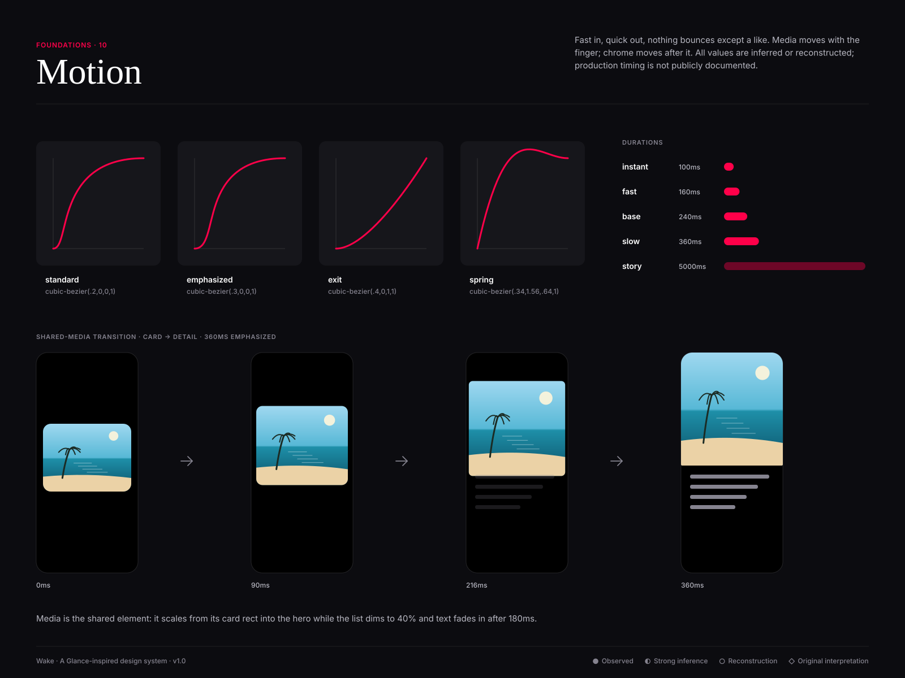

# Motion principles

● Observed · ◐ Strong inference · ○ Reconstruction · ◇ Original interpretation — Glance does not publish motion specs. Values below are **◐ inferred** from the observed interaction model (swipe stories,
one-tap engage) or **○ reconstructed**.

1. **Fast in, quick out.** Enter 240–360ms, exit 240ms.
2. **Media leads.** The image is the shared element; chrome follows.
3. **Follow the finger.** Sheets, stories and rails track the gesture 1:1 and settle with `emphasized` easing.
4. **One spring.** Only the like has overshoot.
5. **Live things breathe.** The live dot pulses; nothing else loops except skeletons.
6. **Respect reduced motion.**

## Tokens
| Duration | Value | | Easing | Curve |
|---|---|---|---|---|
| instant | 100ms | | standard | `cubic-bezier(.2,0,0,1)` |
| fast | 160ms | | emphasized | `cubic-bezier(.3,0,0,1)` |
| base | 240ms | | exit | `cubic-bezier(.4,0,1,1)` |
| slow | 360ms | | spring | `cubic-bezier(.34,1.56,.64,1)` |
| story | 5000ms | | linear | `linear` |

## Interaction table
| Interaction | Duration | Easing | Behaviour | Conf. |
|---:|---:|---|---|---|
| button-press | 100ms | standard | Scale to .97, background to pressed token. | ○ |
| chip-select | 160ms | standard | Fill cross-fades; check icon slides in 4px. | ○ |
| card-hover | 240ms | standard | translateY(-2px), shadow-2 (light) or surface lift (dark); media scales 1.03. | ○ |
| card-press | 100ms | standard | Scale to .98. | ○ |
| like-pop | 360ms | spring | Heart scales 1 → 1.25 → 1 and fills primary. | ◇ |
| sheet-enter | 360ms | emphasized | Slides up from bottom, scrim fades to .48. | ◐ |
| sheet-exit | 240ms | exit | Slides down; follows the finger if dragged. | ◐ |
| modal | 240ms | emphasized | Fade + scale .96 → 1. | ○ |
| carousel-snap | 360ms | emphasized | Snap to nearest card after release; momentum preserved. | ◐ |
| story-advance | 5000ms | linear | Progress bar fills; next story cross-fades 240ms. | ◐ |
| page-push | 360ms | emphasized | New page in from right 24px + fade; old page dims. | ○ |
| shared-media | 360ms | emphasized | Card media expands into the detail hero (shared element). | ◇ |
| skeleton-shimmer | 1400ms | linear | Gradient sweep left to right, loops until data arrives. | ○ |
| live-pulse | 1600ms | standard | Live dot ring scales 1 → 2.2, opacity .6 → 0, loops. | ◇ |
| toast | 240ms | emphasized | Rises 16px + fade; auto-dismiss after 4s. | ○ |

## Reduced motion
Transforms → 0ms; cross-fades 160ms; story auto-advance paused (tap to advance); live pulse off; skeleton shimmer becomes static.
